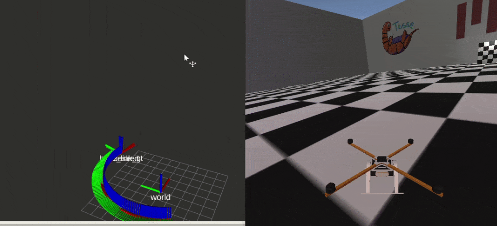

# Introduction
 * Currently Updating the repository with videos and more detailed explanation
 * These projects are based on MIT - VNAV course

 * The current repository shows an ROS based implementation of an Geometric Controller in SE3 to follow a desired trajcteory in 3D space.

# ROS and Tesse framework
1. Topics
* desired_state
* rotor_speeds
* current state
2. Nodes
* traj_publisher
* controller_node

Breif:
* A publisher node publishes 'desried states' of the trajectory to a desire_state topic.
* This topic is subscribed by the controller node along with current_state topic.
* The data from these topics is used for calculating the rotor speeds of the quadrotor to match the desried state at that particular time step.

 # Results

 
 
